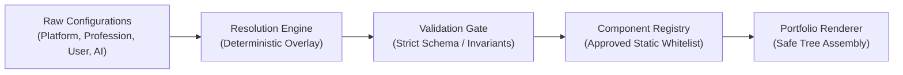
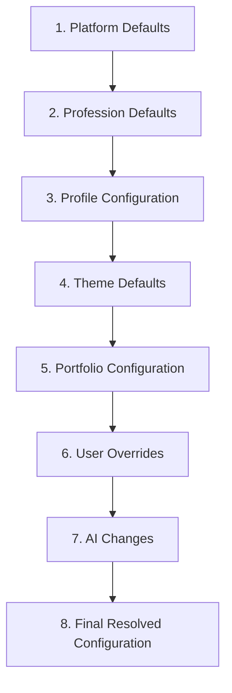
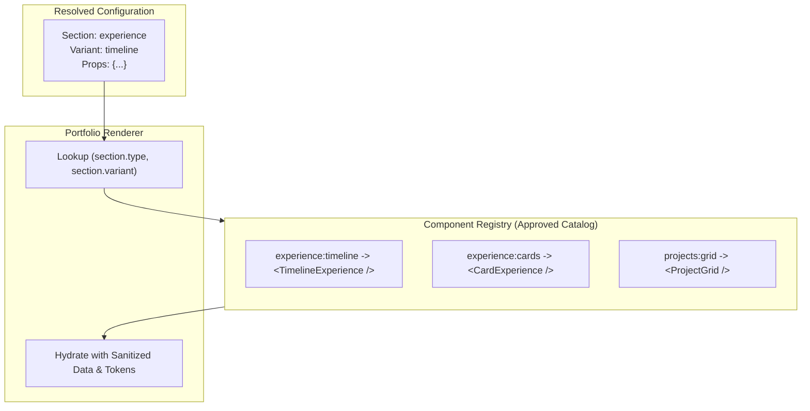

# Configuration Architecture

> **Document Status**: Draft / Approved for Technical Foundation (TF-01)  
> **Target Scope**: Multi-Profession AI-Powered Professional Identity Platform  
> **Core Pipeline**: `Configuration → Resolution → Validation → Approved Components → Renderer`

---

## 1. Purpose

The Professional Identity Platform is designed to support a vast spectrum of professions (e.g., Software Engineers, Physicians, Product Designers, Lawyers, Academics) and diverse presentation formats without creating separate applications or hard-coded pages for each domain.

To achieve this scalability, the platform decouples:
- **Professional Identity (Data)**: The normalized factual record of a user's career, education, skills, credentials, and achievements.
- **Presentation (Configuration)**: Declarative specifications detailing layout structure, section ordering, visual styles, and component variant selections.
- **Execution (Renderer & Component Registry)**: Statically typed, security-approved UI components that transform resolved configurations into web interfaces.

This architecture enables:
1. **Multi-Tenancy across Professions**: Supporting any profession via declarative configuration presets rather than customized codebases.
2. **Dynamic Evolution**: Allowing users and AI agents to modify layout, styling, and tone without executing arbitrary or untrusted code.
3. **Safe AI Iteration**: Constraining AI assistants to structured, schema-validated configuration mutations.

---

## 2. Architectural Principles

### 2.1 The Core Execution Pipeline

The runtime flow strictly enforces a unidirectional pipeline:

1. **Configuration**: Layered declarative specifications stored as structured JSON.
2. **Resolution**: Deterministic hierarchical merging of defaults, profile choices, user overrides, and AI suggestions.
3. **Validation**: Runtime schema verification (e.g., Zod / JSON Schema) ensuring data integrity, type safety, and domain constraints.
4. **Approved Components**: Whitelisted, pre-compiled UI building blocks located in the codebase.
5. **Renderer**: A secure rendering engine that hydrates approved components with resolved data.

### 2.2 Core Invariants
- **Structured Data Only**: Configuration must consist exclusively of declarative data (primitives, arrays, and objects). No executable JavaScript, TypeScript, JSX, or arbitrary CSS strings may ever exist within configuration payloads.
- **Fail-Safe Fallbacks**: If any user override or AI adjustment is invalid or unsupported, resolution gracefully falls back to the profession or platform default.
- **Immutable Inputs**: Each layer remains pure and untouched; resolution produces a new, immutable resolved document.
- **Zero Remote Code Execution (RCE)**: The renderer will never use `eval()`, `new Function()`, or dynamic remote script injection.

---

## 3. Configuration Layers

The configuration system is divided into eight discrete layers, evaluated in order of precedence:

1. **Platform Defaults**: System-wide baseline settings, default capabilities, standard fallback components, and global metadata schemas.
2. **Profession Defaults**: Archetypal templates tailored to specific professions (e.g., medical vs. engineering vs. creative portfolios).
3. **Profile Configuration**: Core user identity attributes, selected primary profession, active credentials, and profile-level visibility switches.
4. **Theme Defaults**: Prescribed aesthetic token suites (typography scale, spacing system, color palettes, elevation, radius).
5. **Portfolio Configuration**: Instance-level portfolio layout choices (chosen theme ID, selected sections, canonical ordering, display variants).
6. **User Overrides**: Explicit manual fine-tuning performed by the user (custom section labels, specific color overrides, custom ordering).
7. **AI Changes**: Structured proposals and mutations generated by AI assistants (suggested section reordering, tone/emphasis adjustments, headline copy refinement).
8. **Final Resolved Configuration**: The fully compiled, validated, immutable JSON document ingested by the renderer.

---

## 4. Responsibility and Boundaries of Each Layer

| Layer | Primary Responsibilities | Allowed Data | Prohibited Data |
| :--- | :--- | :--- | :--- |
| **1. Platform Defaults** | Defines absolute system fallbacks, supported core section types, global security restrictions, and fallback tokens. | Supported section types, default component identifiers, platform metadata. | User-specific data, profession-specific opinions, custom inline scripts. |
| **2. Profession Defaults** | Defines recommended section suites, vocabulary labels, default section order, and primary tone suited to a domain. | Standard section order for profession, domain-specific terminology, recommended theme IDs. | Direct user personal data, unapproved third-party component references. |
| **3. Profile Configuration** | Links the individual to their identity data, profession choice, and data-level flags. | Profession identifier, active contact handles, credential visibility flags. | Layout styles, component DOM attributes, direct CSS values. |
| **4. Theme Defaults** | Establishes coherent design token systems for visual balance. | Color palettes (hex/oklch tokens), typography scales, spacing units, border radius tokens. | Content copy, profile experience items, section ordering. |
| **5. Portfolio Configuration** | Organizes how a specific portfolio presents identity data. | Active section list, section variant mappings, theme selection, navigation style. | Direct executable logic, raw unparsed stylesheets. |
| **6. User Overrides** | Preserves intentional manual user customisations. | Keyed overrides of labels, token values within bounds, section visibility toggles. | Overriding system security rules, injection of arbitrary markup. |
| **7. AI Changes** | Applies AI-assisted enhancements and personalized layouts. | Structured delta patches matching the AI Delta Schema (section re-weighting, copy proposals). | Free-form HTML/code, direct database modifications, security bypasses. |
| **8. Final Resolved Config** | Serves as the complete runtime input contract for the portfolio renderer. | Flattened, fully resolved tree of sections, props, and design tokens ready for execution. | Unresolved template variables, merge conflicts, pending validation flags. |

---

## 5. Configuration Precedence & Resolution Pipeline

### 5.1 Precedence Rules

Precedence flows from **least specific (Platform Defaults)** to **most specific (AI / User Overrides)**:

$$\text{Platform Defaults} \prec \text{Profession Defaults} \prec \text{Profile Config} \prec \text{Theme Defaults} \prec \text{Portfolio Config} \prec \text{User Overrides} \prec \text{AI Changes}$$

*Note on AI Changes vs. User Overrides*: When an AI proposes changes in interactive editing mode, changes can exist as a preview layer on top of User Overrides. Once accepted by the user, AI adjustments commit into User Overrides or Portfolio Configuration.

### 5.2 Resolution Strategy

1. **Primitive Values**: Last writer wins (shallow scalar replacement).
2. **Token Maps & Style Dictionaries**: Deep merge on matching keys.
3. **Sections & Component Lists**: Keyed resolution based on stable `sectionId`:
   - Sections present in lower layers are inherited.
   - If an override specifies `enabled: false`, the section is omitted.
   - Ordering is determined by the highest-precedence layer that explicitly defines `sectionOrder`.
4. **Validation Checkpoint**:
   - The resolved configuration must strictly conform to `ResolvedPortfolioConfigSchema`.
   - Any property failing validation triggers a fallback for that subtree to the nearest valid lower-precedence default.

---

## 6. Configuration → Component Mapping

The rendering layer never accepts component definitions over the wire. Instead, it relies on a compile-time **Component Registry**.

### 6.1 The Component Registry
- A centralized dictionary registering statically imported, tested, and secure UI components.
- Each registry entry specifies:
  - `componentId`: Unique identifier (e.g., `experience:timeline`).
  - `propsSchema`: Validation contract for props passed to this component.
  - `slots`: Supported sub-component slots (if composite).
  - `defaultVariant`: Fallback variant if the requested one is absent.

### 6.2 Safe Hydration Process
1. Renderer walks the resolved `sections` array in order.
2. For each section, reads `type` and `variant`.
3. Looks up the matching component in the Component Registry:
   - If found: renders `<ApprovedComponent {...sanitizedProps} />`.
   - If missing/unsupported: logs a warning and falls back to `registry.getDefault(section.type)`.

---

## 7. Profession-Specific Configuration Approach

Instead of branching codebase logic or hosting separate Next.js applications for different professions, profession customization is managed entirely via **Profession Manifests**.

### 7.1 Architecture of a Profession Manifest

A profession configuration defines:
1. **Default Section Layout**:
   - *Software Engineer*: Hero → Tech Stack → Projects & Repositories → Experience → Open Source.
   - *Academic / Researcher*: Hero → Biography → Publications & Papers → Research Interests → Teaching → Grants.
   - *Physician / Clinician*: Hero → Credentials & Board Certifications → Clinical Specializations → Hospital Affiliations → Education & Residency.
   - *Designer*: Hero → Visual Case Studies → Selected Works → Design Philosophy → Experience.
2. **Vocabulary Overrides**:
   - Customizing labels without altering data models (e.g., "Experience" is labeled "Clinical Rotations" for medical interns, "Exhibitions" for fine artists).
3. **Curated Theme Presets**:
   - Suggesting default themes matched to domain expectations (e.g., authoritative/clean for medical/legal; expressive/grid-based for creative professions).

---

## 8. AI Interaction Boundaries

AI capabilities in the platform must act as intelligent **assistants within boundaries**, not unbounded code generators.

### 8.1 Boundaries and Constraints
- **Structured Deltas Only**: AI inputs and outputs are restricted to JSON delta patches that validate against an explicit `AIDeltaPatchSchema`.
- **No Direct Code Generation**: AI cannot generate JSX, React components, CSS files, or executable scripts.
- **No Unauthorized Scope Access**: AI changes cannot alter account ownership, security settings, subscription tiers, or bypass validation rules.
- **Drafting and Reversibility**: AI recommendations are treated as staged modifications. Users can preview diffs, accept individual changes, or discard them entirely.

---

## 9. Security Constraints

1. **Content Security Policy (CSP) Alignment**:
   - Zero inline script execution.
   - Inline style attributes are restricted to safe CSS variable bindings derived from approved theme tokens.
2. **Prototype Pollution Protection**:
   - Deep merge functions in the resolution engine must sanitize reserved keys (`__proto__`, `constructor`, `prototype`).
3. **HTML Sanitization**:
   - Any user-provided or AI-refined text field that supports formatted text (e.g., Markdown) must pass through a strict sanitizer disallowing script tags, iframes, and arbitrary event handlers.
4. **No Dynamic Code Evaluation**:
   - Disallow `eval`, `Function()`, `dangerouslySetInnerHTML` with raw configuration input, or dynamic script loading.

---

## 10. Extensibility Principles

- **Adding a New Profession**: Create a new declarative profession descriptor JSON/object containing default sections, labels, and theme mappings. Zero renderer code changes needed.
- **Adding a New Theme**: Add a design token preset JSON/object conforming to the `ThemeTokensSchema`.
- **Adding a New Component or Variant**:
  1. Build and unit-test the React component in the approved component library.
  2. Register the component in the Component Registry with its `propsSchema`.
  3. Expose the new `variant` key in the configuration schema.
- **Schema Versioning**: Every configuration document maintains a `schemaVersion` integer. A schema migration pipeline will handle upgrading legacy configurations when schemas evolve.

---

## 11. Future Dependencies

*Note: For TF-01, these dependencies are documented for roadmap planning and are NOT installed or built at this stage.*

1. **Schema Validation**: [Zod](https://zod.dev) (or equivalent standard schema validator) for strict runtime parsing and TypeScript type inference.
2. **Shared Configuration Package**: A standalone package (e.g., `packages/config` or `packages/core`) containing schemas, default manifests, and pure resolution functions reusable across web and API applications.
3. **Deep Merge Utility**: A deterministic, prototype-safe object merger.
4. **Sanitization Engine**: A lightweight HTML/Markdown sanitizer (e.g., DOMPurify or sanitize-html) for formatted text fields.

---

## 12. Open Architectural Decisions

The following architectural questions are identified during TF-01 for resolution in upcoming technical foundation tasks:

1. **Array Resolution Semantics**:
   - *Question*: When a higher-precedence layer specifies an array (e.g., `sections`), does it replace the array entirely, or perform a keyed merge based on a unique identifier (e.g., `sectionId`)?
   - *Initial Preference*: Keyed merge with explicit ordering array (`sectionOrder: ["hero", "projects", "experience"]`) to prevent unintentional loss of default section settings when overriding order.
2. **AI Changes Persistence Model**:
   - *Question*: Should AI changes persist as a dedicated layer in the database, or should they immediately fold into `User Overrides` once accepted by the user?
   - *Trade-off*: A dedicated AI layer allows detailed version history and undo/redo of AI suggestions, but increases database schema complexity and resolution overhead.
3. **Resolution Location (Server vs. Client)**:
   - *Question*: Should configuration resolution occur strictly on the server during data fetching/SSR, or also client-side in the portfolio customizer?
   - *Trade-off*: Pure server-side resolution maximizes security and performance for public portfolios; dual client/server resolution enables instantaneous real-time previews during editing.
4. **Theme Token Abstraction Level**:
   - *Question*: Should theme tokens map directly to Tailwind CSS utility classes / CSS custom properties, or remain completely abstract semantic tokens (e.g., `surface.primary`, `accent.vibrant`)?
   - *Initial Preference*: Abstract semantic CSS custom properties mapped to Tailwind classes for flexibility and consistency.
