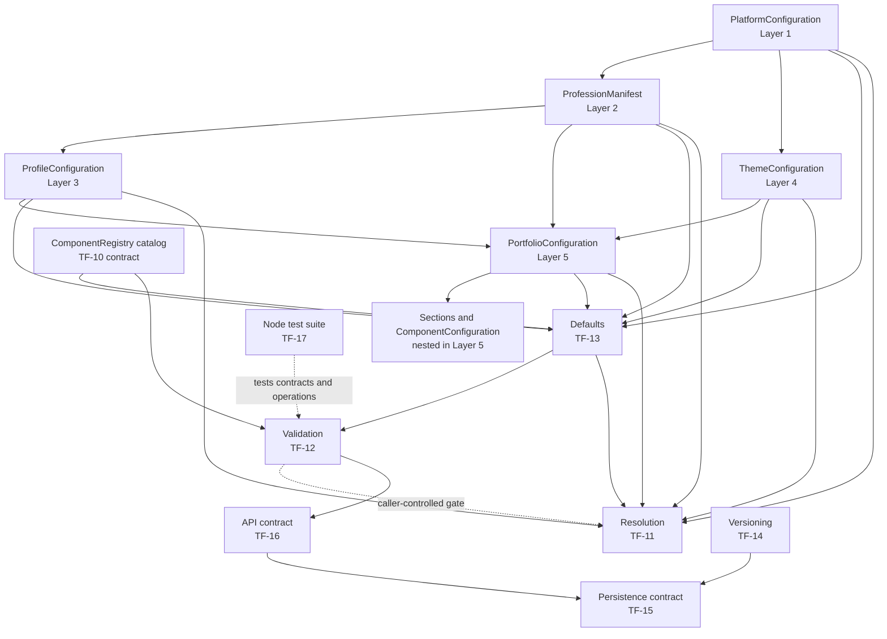

# Configuration Architecture

This guide describes the configuration contracts and operations implemented in `apps/web/config` through TF-17. The normative field-by-field schema is [Configuration Schema](./configuration-schema.md); TypeScript types and the module README files linked below are the source for current implementation behavior. This guide does not extend those contracts.

## Purpose and scope

Configuration is declarative data that selects and relates platform capabilities, profession defaults, profile presentation preferences, and portfolio presentation choices. The implementation provides TypeScript data contracts and focused, pure functions for defaults, resolution, validation, version semantics, plus interfaces for future persistence and API implementations. The contracts contain no React components or executable configuration payloads.

There is no portfolio renderer or configuration UI in this work. User override and AI proposal layers described in early TF-01 planning are not implemented configuration inputs. The component registry is a typed catalog contract, not a registry of rendered React implementations. Persistence and API modules define contracts only; there is no database, storage adapter, HTTP endpoint, authorization flow, or application orchestration.

## Implemented architecture



The arrows between source configuration types indicate references and inputs, not automatic execution. Callers select matching platform, profession, profile, theme, portfolio, and registry values and choose when to call defaults, validation, resolution, versioning, and future persistence/API adapters. The pure resolver does not call validation; validation and resolution are separate operations. The API and persistence boxes are contracts and do not run as services.

## Configuration layers and relationships

The five configuration layers are the implemented data model. Layer 5 is the portfolio document, and section and component settings are nested within it rather than additional precedence layers. Theme and profession are separate referenced documents; the resolver and defaults operation accept them explicitly.

| Layer | Contract | Role and relationship |
| --- | --- | --- |
| 1 | [Platform Configuration](../../apps/web/config/platform/README.md) | Static platform catalog, supported professions and section types, shipped theme IDs, default component mappings, and security limits. |
| 2 | [Profession Manifest](../../apps/web/config/profession/README.md) | Profession-specific available sections, default order, vocabulary, recommended/default themes, highlighted attributes, and SEO defaults. References Layer 1 catalogs. |
| 3 | [Profile Configuration](../../apps/web/config/profile/README.md) | Identity linkage and presentation/visibility settings, including profession IDs. It is not the store of biographical or career records. |
| 4 | [Theme Configuration](../../apps/web/config/theme/README.md) | Semantic visual tokens and optional per-component style defaults. A portfolio selects a theme by ID. |
| 5 | [Portfolio Configuration](../../apps/web/config/portfolio/README.md) | Portfolio identity, profile and theme references, navigation, ordered section IDs, section configurations, footer, SEO, color mode, and audit metadata. |

`SectionConfiguration` is a Layer 5 member selected by `sectionOrder`; it carries enabled state, optional title/subtitle and filter, layout, variant, and a `componentConfig`. That member uses the existing [Component Configuration](../../apps/web/config/component/README.md) contract, which names a component ID and variant and carries typed props, style settings, and responsive flags. Component Configuration is a dependency of section and portfolio contracts, not a second competing system.

Profession manifests provide defaults and allowed section choices, while a profile links the portfolio to a professional identity and chosen profession. A portfolio references a theme and arranges its selected sections. The platform catalog constrains the IDs and supported capabilities. These types describe relationships; they do not load referenced documents or guarantee their coherence by themselves.

## Component registry

The [Component Registry](../../apps/web/config/component/README.md) module defines `ComponentDescriptor` and `ComponentRegistry` catalog types. TF-10 supplies a typed catalog used by validation and defaults. In the current source there are no concrete component render implementations and no runtime lookup or rendering registry. Describing a catalog must not be read as implementing component rendering.

## Distinct configuration operations

These modules have separate responsibilities and are not a generic configuration manager:

| Concern | Implemented behavior | Module |
| --- | --- | --- |
| Defaults | `applyConfigurationDefaults` prepares a new partial portfolio draft. It fills only omitted (`undefined`) values from explicitly supplied sources, preserves explicit values even when invalid, and reports applied defaults and unresolved paths. | [TF-13](../../apps/web/config/defaults/README.md) |
| Validation | `validateConfiguration` checks an explicitly selected configuration set and registry, returning `{ valid, issues }` with severity, code, path, and message. It is read-only and does not repair or default values. | [TF-12](../../apps/web/config/validation/README.md) |
| Resolution | `resolvePortfolioConfiguration` composes explicitly supplied valid/coherent source objects into the TF-02 resolved shape. Portfolio `sectionOrder` determines order; disabled sections are omitted; titles and styles use documented fallbacks/overlays; nested output values are copied. It assumes, but does not perform, validation. | [TF-11](../../apps/web/config/resolution/README.md) |
| Versioning | Reads supported schema/revision metadata and creates a copied next revision using an explicit timestamp. It does not migrate schemas, validate the full configuration, or persist it. | [TF-14](../../apps/web/config/versioning/README.md) |
| Persistence | Defines generic create/get/exists/update repository contracts, including identity and optimistic revision conflict semantics. It has no storage adapter. | [TF-15](../../apps/web/config/persistence/README.md) |
| API | Defines transport-neutral create/get/update request and structured response/error contracts. It has no routes, handlers, orchestration, or client. | [TF-16](../../apps/web/config/api/README.md) |

Defaults do not invoke validation or resolution. Validation does not invoke resolution. Resolution expects selected inputs and is not an implicit API or persistence step. Future orchestration must choose the order and handle each result explicitly. For instance, a caller preparing a draft can apply defaults and then validate once enough required values exist; any later resolution call remains explicit.

## Version concepts

Four values have different meanings and must not be interchanged:

| Field or constant | Meaning |
| --- | --- |
| `schemaVersion` | Structure of a configuration document. The current supported schema version is the literal `1`; TF-14 compatibility currently requires supported, equal schema versions. No migration pipeline exists. |
| `audit.version` (`AuditMetadata.version`) | Revision number of an individual audited Profile, Theme, or Portfolio document. TF-14 increments it when explicitly asked to create a next revision. |
| `PlatformConfiguration.metadata.version` | Version string of the platform configuration bundle. Platform Configuration does not use `AuditMetadata` and this is not a per-document revision. |
| `ConfigurationApiContractVersion` | Literal `1` for the TF-16 TypeScript API contract shape. It is not an HTTP URL/header strategy, schema version, or configuration revision. |

`resolvedAt` is a caller-supplied resolution timestamp. It is not a revision and does not increment any audit field. Defaults do not change audit metadata.

## Testing

The dedicated suite is in [`apps/web/config-tests`](../../apps/web/config-tests/configuration.test.ts), with shared input data in [`fixtures.ts`](../../apps/web/config-tests/fixtures.ts). It uses Node's built-in `node:test` and `node:assert/strict` runner, so it adds no testing dependency. From `apps/web`, run:

```sh
npm test
```

The package script compiles the test TypeScript with `tsconfig.config-tests.json` into the ignored `.next/config-test-build` directory and runs the compiled test file with `node --test`. The suite currently has 17 tests across seven areas: source catalogs and type relationships, resolution, validation, defaults, versioning, an in-memory test adapter for persistence contract semantics, and API request/error contracts. The in-memory adapter is test-only and is not a production persistence implementation.

## Extension guidance

Make changes at the owning contract and keep source types authoritative:

1. **Add a configuration type:** first update the relevant section of [the schema](./configuration-schema.md), then add a declarative type in the matching `apps/web/config/<layer>/types.ts`, export it through that module's `index.ts`, and document actual semantics in its README. Reuse shared identifiers, audit metadata, schema versions, and referenced types; do not duplicate them.
2. **Add a profession manifest:** implement `ProfessionManifest` in `config/profession/manifests`, export/register it in the profession catalog, and ensure its IDs, sections, variants, and theme choices exist in platform catalogs. Extend fixtures/tests for catalog relationships.
3. **Add a section:** select a platform-supported section type and represent it as a `SectionConfiguration` nested in a `PortfolioConfiguration`; include its ID in portfolio order as appropriate. Its `componentConfig` must use the existing `ComponentConfiguration` type. Current contracts do not add a renderer.
4. **Add a component:** update the declarative component/catalog contract as required and update relevant fixtures and validation expectations. The current registry types do not register executable UI components; implementing rendering is separate work.
5. **Add a theme:** add a `ThemeConfiguration`, ensure its `themeId` is included in platform support, and update any profession recommendation/default references and tests.
6. **Add validation rules:** extend the owning TF-12 validation function with stable issue code/path/message semantics, keep validation read-only, and add valid and invalid cases in the configuration suite.
7. **Add defaults:** extend TF-13 with explicit sources and precedence, only fill omitted values unless its documented contract is intentionally revised, report unresolved required values, and test immutability and explicit-value preservation.
8. **Work with revisions:** use TF-14 helpers with an explicit UTC `updatedAt`; preserve `schemaVersion` for ordinary edits. Schema migrations are not implemented, so a schema change requires separate migration design.
9. **Implement persistence:** implement `ConfigurationRepository<T>` in a separate adapter, honor stable identity, copying/serialization requirements, duplicate behavior, and atomic optimistic compare-and-replace via TF-14. Select the provider and transaction mechanism in that future task; do not infer one from this interface.
10. **Consume the API contract:** use TF-16 request/response and error unions in a future transport/application layer, map validation issues and persistence version conflicts to their existing structured errors, and keep API contract version separate from document versions. No HTTP endpoint or orchestration is currently provided.
11. **Add tests:** extend `config-tests/configuration.test.ts` and shared fixtures, using the existing `npm test` command and built-in Node runner.

Changes to public shape should be reflected in both the normative schema and the owning module documentation. Avoid creating parallel registries, version fields, validation models, or duplicate architecture guides.

## Explicit implementation boundaries

The current configuration architecture does not implement rendering, a configuration resolver/validator service, default persistence, database or ORM, HTTP API, API client, authentication or authorization, editor or runtime behavior, migrations, user overrides, AI change proposals, remote code loading, or a production component registry. These may be considered in future work, but the current contracts do not imply their existence.
