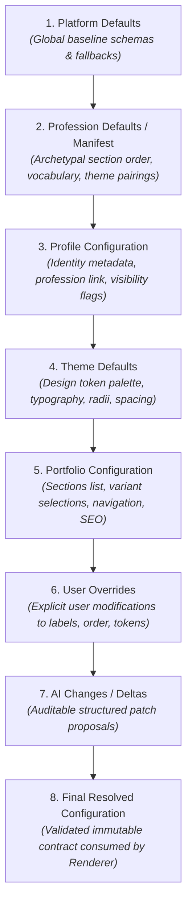
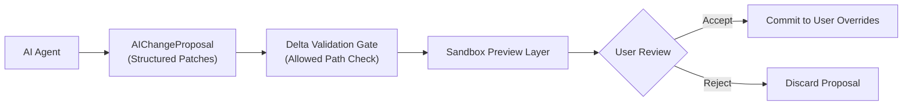

# Configuration Schema Specification

> **Document Status**: Draft / Approved for Technical Foundation (TF-02)  
> **Preceding Architecture**: [`docs/architecture/configuration-architecture.md`](file:///c:/Users/admin/OneDrive/Documents/Portfolio/professional-identity-platform/docs/architecture/configuration-architecture.md)  
> **Scope**: Declarative Schema Contracts for Platform, Profession, Profile, Theme, Portfolio, User Overrides, AI Deltas, and Resolved Configurations  
> **Core Pipeline**: `Configuration → Resolution → Validation → Approved Components → Renderer`

---

## 1. Purpose

This document establishes the formal schema contracts for the configuration-driven Professional Identity Platform. It translates the 8-layer architecture defined in **TF-01** into concrete, declarative data contracts.

These schemas govern:
- How platform and profession presets are authored and loaded.
- How user preferences, portfolio structure, and visual themes are persisted.
- How AI agents generate safe, auditable design proposals.
- How the runtime resolution engine compiles layered configurations into a unified document for the component registry and portfolio renderer.

---

## 2. Schema Design Principles

1. **Strictly Declarative & Code-Free**:
   - Configurations contain structured data only (primitives, arrays, key-value maps, and enums).
   - Zero executable code: No JavaScript/TypeScript statements, React/JSX expressions, function declarations, CSS `<style>` blocks, or HTML script tags.
2. **Strict Separation of Concerns**:
   - **Identity Data**: Factual records of career history, skills, and credentials.
   - **Presentation Configuration**: Layout, section hierarchy, visibility, and component variant assignments.
   - **Design Tokens**: Structured aesthetics (typography, color palettes, spacing, elevation).
   - **Component Implementations**: Compiled React UI components maintained strictly in the codebase registry.
3. **Deterministic Resolution**:
   - Given the same set of layer inputs, the resolution pipeline produces an identical resolved configuration output every time.
4. **Resilient Fallbacks**:
   - Missing, deprecated, or invalid configuration values fall back cleanly to the nearest valid lower-precedence layer (Profession Defaults $\to$ Platform Defaults).
5. **Schema Versioning**:
   - Every primary schema entity carries a `schemaVersion` integer to support automated migrations as the platform evolves.
6. **Framework Agnosticism**:
   - The schemas describe structural layouts, design tokens, and component contracts rather than framework-specific rendering details.

---

## 3. Configuration Hierarchy

The configuration system resolves settings through the 8 layers defined in TF-01:



---

## 4. Common Identifiers and Metadata

All schema entities share common identifiers, timestamps, and audit metadata.

```typescript
/** Semantic version or integer schema revision */
export type SchemaVersion = 1;

/** Standard identifier: lowercase alphanumeric, hyphens, and underscores */
export type EntityId = string; // Pattern: ^[a-z0-9_-]{2,64}$

/** ISO 8601 UTC timestamp string */
export type ISOTimestamp = string; // e.g. "2026-09-26T22:00:00Z"

/** Provenance and audit metadata */
export interface AuditMetadata {
  createdAt: ISOTimestamp;
  updatedAt: ISOTimestamp;
  version: number;
  source: 'system' | 'user' | 'ai' | 'admin';
}

/** Visual display mode */
export type ColorMode = 'light' | 'dark' | 'system';

/** Responsive breakpoints supported across configurations */
export type BreakpointKey = 'mobile' | 'tablet' | 'desktop' | 'wide';
```

---

## 5. Layer 1: Platform Configuration (Platform Defaults)

The Platform Configuration defines the global system envelope, supported component types, and unyielding constraints.

```typescript
export interface PlatformConfiguration {
  schemaVersion: SchemaVersion;
  platformId: string;
  metadata: {
    name: string;
    version: string;
  };
  supportedProfessions: EntityId[];
  supportedSectionTypes: Array<{
    type: string;
    label: string;
    description: string;
    allowedVariants: string[];
    defaultVariant: string;
    isSingleton: boolean;
  }>;
  defaultThemeId: EntityId;
  supportedThemes: EntityId[];
  securityLimits: {
    maxSectionsPerPortfolio: number;
    maxCustomLinks: number;
    maxPayloadSizeBytes: number;
    allowedUrlProtocols: ('http:' | 'https:' | 'mailto:' | 'tel:')[];
  };
  defaultComponentMappings: Record<string, string>; // sectionType -> defaultComponentId
}
```

---

## 6. Layer 2: Profession Defaults / Profession Manifest

A **Profession Manifest** establishes domain-tailored defaults so that different professions (e.g., Software Engineers, Physicians, Architects) render appropriately without requiring distinct applications.

```typescript
export interface ProfessionManifest {
  schemaVersion: SchemaVersion;
  professionId: EntityId; // e.g. "software-engineer", "physician", "graphic-designer"
  displayName: string;
  category: string; // e.g. "Engineering", "Healthcare", "Creative Arts", "Legal"
  description: string;
  recommendedThemes: EntityId[];
  defaultThemeId: EntityId;
  
  /** Archetypal section layout and initial visibility */
  defaultSectionOrder: string[]; // e.g. ["hero", "credentials", "experience", "publications"]
  availableSections: Array<{
    sectionId: string;
    type: string;
    titleDefault: string;
    defaultVariant: string;
    isRequired: boolean;
    defaultEnabled: boolean;
  }>;

  /** Domain-specific vocabulary substitutions */
  vocabulary: {
    experienceSectionTitle: string; // e.g. "Work Experience" vs "Clinical Rotations" vs "Exhibitions"
    projectsSectionTitle: string;   // e.g. "Projects" vs "Clinical Trials" vs "Selected Works"
    credentialsSectionTitle: string;// e.g. "Certifications" vs "Board Certifications & Licensure"
    skillsSectionTitle: string;     // e.g. "Technical Skills" vs "Clinical Competencies"
    publicationsSectionTitle: string;
    heroRoleLabel: string;
  };

  /** Specific attributes prioritized in identity cards and headers */
  highlightedAttributes: string[]; // e.g. ["github", "techStack"] vs ["hospitalAffiliations", "npiNumber"]

  seoDefaults: {
    titleTemplate: string; // e.g. "%name% | %role% Portfolio"
    defaultKeywords: string[];
  };
}
```

---

## 7. Layer 3: Profile Configuration

The Profile Configuration bridges the user's factual identity data with platform-level display preferences.

> [!NOTE]
> Profile Configuration contains *display flags and linkages*, NOT the raw biographical resume records (which reside in the normalized identity data store).

```typescript
export interface ProfileConfiguration {
  schemaVersion: SchemaVersion;
  profileId: EntityId;
  userId: EntityId;
  primaryProfessionId: EntityId;
  secondaryProfessionIds?: EntityId[];
  slug: string; // Custom public handle, e.g. "pankaj-singh"
  customDomain?: string; // Optional verified custom domain
  locale: string; // e.g. "en-US"
  status: 'draft' | 'published' | 'archived';
  
  /** Privacy and contact visibility switches */
  visibility: {
    isPublic: boolean;
    showContactEmail: boolean;
    showPhoneNumber: boolean;
    showLocation: boolean;
    allowSearchIndexing: boolean;
  };

  /** Social and professional link configurations */
  socialLinks: Array<{
    platform: 'github' | 'linkedin' | 'x' | 'orcid' | 'dribbble' | 'website' | 'other';
    url: string;
    label: string;
    visible: boolean;
  }>;

  audit: AuditMetadata;
}
```

---

## 8. Layer 4: Theme Configuration & Design Tokens

Theme configurations define the complete aesthetic envelope through structured design tokens.

```typescript
export interface ThemeTokens {
  colors: {
    // Semantic color roles
    background: string;       // Hex / OKLCH / HSL
    surface: string;
    surfaceSubtle: string;
    surfaceElevated: string;
    textPrimary: string;
    textSecondary: string;
    textMuted: string;
    accent: string;
    accentHover: string;
    accentContrast: string;   // Color for text placed over accent
    border: string;
    borderSubtle: string;
    success: string;
    warning: string;
    error: string;
  };
  typography: {
    fonts: {
      heading: string;        // Web font family stack
      body: string;
      mono?: string;
    };
    scale: {
      xs: string;             // e.g. "0.75rem"
      sm: string;             // e.g. "0.875rem"
      base: string;           // e.g. "1rem"
      lg: string;             // e.g. "1.125rem"
      xl: string;             // e.g. "1.25rem"
      '2xl': string;          // e.g. "1.5rem"
      '3xl': string;          // e.g. "1.875rem"
      '4xl': string;          // e.g. "2.25rem"
    };
    weights: {
      regular: number;        // e.g. 400
      medium: number;         // e.g. 500
      semibold: number;       // e.g. 600
      bold: number;           // e.g. 700
    };
    lineHeights: {
      tight: number;          // e.g. 1.2
      normal: number;         // e.g. 1.5
      relaxed: number;        // e.g. 1.75
    };
  };
  spacing: {
    unit: string;             // Base unit, e.g. "4px"
    containerMaxWidth: string;// e.g. "1200px"
    sectionPaddingY: string;  // e.g. "4rem"
  };
  radii: {
    none: string;             // "0px"
    sm: string;               // "4px"
    md: string;               // "8px"
    lg: string;               // "16px"
    full: string;             // "9999px"
  };
  shadows: {
    none: string;
    subtle: string;
    medium: string;
    prominent: string;
  };
  transitions: {
    fast: string;             // "150ms cubic-bezier(0.4, 0, 0.2, 1)"
    normal: string;           // "250ms cubic-bezier(0.4, 0, 0.2, 1)"
  };
}

export interface ThemeConfiguration {
  schemaVersion: SchemaVersion;
  themeId: EntityId;
  displayName: string;
  author: 'platform' | 'profession' | 'user';
  baseMode: ColorMode;
  tokens: {
    light: ThemeTokens;
    dark?: Partial<ThemeTokens>;
  };
  componentDefaults?: Record<string, Partial<ComponentStyleConfiguration>>;
  audit: AuditMetadata;
}
```

---

## 9. Layer 5: Portfolio Configuration

The Portfolio Configuration organizes how a specific portfolio instance structures identity data for presentation.

```typescript
export interface NavigationLinkConfig {
  label: string;
  targetSectionId: string;
  visible: boolean;
}

export interface PortfolioNavigationConfig {
  style: 'top-bar' | 'floating' | 'sidebar' | 'minimal' | 'none';
  sticky: boolean;
  showContactAction: boolean;
  customLinks?: NavigationLinkConfig[];
}

export interface PortfolioFooterConfig {
  showSocials: boolean;
  showBackToTop: boolean;
  customCopyrightNotice?: string;
  showPoweredBy: boolean;
}

export interface PortfolioSeoConfig {
  metaTitle?: string;
  metaDescription?: string;
  ogImage?: string;
  noIndex?: boolean;
}

export interface PortfolioConfiguration {
  schemaVersion: SchemaVersion;
  portfolioId: EntityId;
  profileId: EntityId;
  title: string;
  themeId: EntityId;
  colorMode: ColorMode;
  navigation: PortfolioNavigationConfig;
  sectionOrder: string[]; // Array of unique section IDs defining rendering order
  sections: Record<string, SectionConfiguration>;
  footer: PortfolioFooterConfig;
  seo: PortfolioSeoConfig;
  audit: AuditMetadata;
}
```

---

## 10. Section Configuration Structure

Each section represents a distinct presentation block in the portfolio (e.g., Hero, Work Experience, Research Projects).

```typescript
export interface ResponsiveLayoutConfig {
  containerWidth: 'full' | 'wide' | 'standard' | 'narrow';
  columns: {
    mobile: 1;
    tablet: 1 | 2;
    desktop: 1 | 2 | 3 | 4;
  };
  alignment: 'left' | 'center' | 'right';
  paddingY: 'compact' | 'normal' | 'spacious';
}

export interface SectionFilterConfig {
  tagFilter?: string[];
  featuredOnly?: boolean;
  maxItems?: number;
  sortBy?: 'chronological-desc' | 'chronological-asc' | 'priority' | 'manual';
}

export interface SectionConfiguration {
  sectionId: EntityId; // Unique within the portfolio, e.g. "hero-1", "exp-main"
  type: string;        // e.g. "hero", "experience", "projects", "skills", "publications"
  enabled: boolean;
  title?: string;      // Resolved or customized section heading
  subtitle?: string;   // Optional section descriptive text
  variant: string;     // e.g. "timeline", "cards", "minimal", "grid"
  layout: ResponsiveLayoutConfig;
  filter?: SectionFilterConfig;
  componentConfig: ComponentConfiguration;
}
```

---

## 11. Component Configuration Structure

The Component Configuration binds a section to an approved entry in the Component Registry and governs styling parameters.

```typescript
export interface ComponentStyleConfiguration {
  density: 'compact' | 'comfortable' | 'spacious';
  elevation: 'none' | 'subtle' | 'medium' | 'prominent';
  borderStyle: 'none' | 'subtle' | 'prominent';
  accentHighlight: boolean;
  customClassModifiers?: string[]; // Strictly whitelisted modifier tokens
}

export interface ComponentConfiguration {
  componentId: EntityId; // Maps to Component Registry, e.g. "core:experience-timeline"
  variant: string;
  props: Record<string, boolean | number | string | string[]>; // Pure structured data props
  styles: ComponentStyleConfiguration;
  responsive: {
    hideOnMobile?: boolean;
    collapseOnMobile?: boolean;
  };
}
```

---

## 12. Layer 6: User Overrides

User Overrides encapsulate manual fine-tuning made by the user, taking precedence over theme and profession defaults.

```typescript
export interface UserOverrides {
  schemaVersion: SchemaVersion;
  portfolioId: EntityId;
  
  /** Specific token tweaks (e.g. customized primary accent color) */
  themeOverrides?: {
    accentColor?: string;
    fontFamilyHeading?: string;
    fontFamilyBody?: string;
  };

  /** Section order adjustments */
  sectionOrderOverride?: string[];

  /** Overrides indexed by sectionId */
  sectionOverrides?: Record<string, {
    enabled?: boolean;
    title?: string;
    subtitle?: string;
    variant?: string;
    layout?: Partial<ResponsiveLayoutConfig>;
    filter?: Partial<SectionFilterConfig>;
    componentStyles?: Partial<ComponentStyleConfiguration>;
  }>;

  /** Custom vocabulary overrides */
  vocabularyOverrides?: Record<string, string>;

  audit: AuditMetadata;
}
```

---

## 13. Layer 7: AI Changes / Delta Structure

AI agents propose adjustments exclusively via **structured delta proposals**. AI changes never introduce code or arbitrary markup.



```typescript
export type DeltaOperation = 'replace' | 'add' | 'remove';

/** A single JSON Pointer patch conforming to RFC 6902 principles */
export interface AIDeltaPatch {
  op: DeltaOperation;
  /** JSON Pointer path restricted to approved configuration subtrees */
  path: string; // e.g. "/sections/hero/title" or "/themeOverrides/accentColor"
  value?: any;  // Value conforming to schema for the target path
  rationale: string; // Human-readable explanation of why the AI made this change
}

export interface AIChangeProposal {
  schemaVersion: SchemaVersion;
  proposalId: EntityId;
  portfolioId: EntityId;
  intent: string; // e.g. "Refine copy for senior technical leadership"
  generatedAt: ISOTimestamp;
  modelIdentifier: string; // e.g. "gemini-3.8-flash"
  status: 'pending_review' | 'accepted' | 'rejected' | 'partially_accepted';
  patches: AIDeltaPatch[];
}
```

---

## 14. Layer 8: Final Resolved Configuration Structure

The **Final Resolved Configuration** is the compiled, normalized, and validated document produced by the resolution engine. The Portfolio Renderer consumes this document directly.

```typescript
export interface ResolvedSection {
  sectionId: string;
  type: string;
  title: string;
  subtitle?: string;
  variant: string;
  componentId: string;
  layout: ResponsiveLayoutConfig;
  styles: ComponentStyleConfiguration;
  filter?: SectionFilterConfig;
  resolvedProps: Record<string, any>;
}

export interface ResolvedPortfolioConfiguration {
  schemaVersion: SchemaVersion;
  portfolioId: EntityId;
  profileId: EntityId;
  professionId: EntityId;
  title: string;
  locale: string;
  colorMode: ColorMode;
  theme: {
    themeId: EntityId;
    tokens: ThemeTokens;
  };
  navigation: PortfolioNavigationConfig;
  sections: ResolvedSection[]; // Strictly sorted in final display order
  footer: PortfolioFooterConfig;
  seo: PortfolioSeoConfig;
  resolvedAt: ISOTimestamp;
}
```

---

## 15. Example Complete Configuration

Below is a complete, realistic representation of a **Final Resolved Configuration** for a Physician / Clinical Researcher portfolio:

```json
{
  "schemaVersion": 1,
  "portfolioId": "port-cardio-092",
  "profileId": "prof-dr-singh-001",
  "professionId": "physician",
  "title": "Dr. Pankaj Singh, MD, FACC - Cardiovascular Medicine",
  "locale": "en-US",
  "colorMode": "light",
  "theme": {
    "themeId": "clinical-clarity",
    "tokens": {
      "colors": {
        "background": "#f8fafc",
        "surface": "#ffffff",
        "surfaceSubtle": "#f1f5f9",
        "surfaceElevated": "#ffffff",
        "textPrimary": "#0f172a",
        "textSecondary": "#334155",
        "textMuted": "#64748b",
        "accent": "#0369a1",
        "accentHover": "#0284c7",
        "accentContrast": "#ffffff",
        "border": "#e2e8f0",
        "borderSubtle": "#f1f5f9",
        "success": "#16a34a",
        "warning": "#d97706",
        "error": "#dc2626"
      },
      "typography": {
        "fonts": {
          "heading": "Inter, system-ui, sans-serif",
          "body": "Inter, system-ui, sans-serif"
        },
        "scale": {
          "xs": "0.75rem",
          "sm": "0.875rem",
          "base": "1rem",
          "lg": "1.125rem",
          "xl": "1.25rem",
          "2xl": "1.5rem",
          "3xl": "1.875rem",
          "4xl": "2.25rem"
        },
        "weights": {
          "regular": 400,
          "medium": 500,
          "semibold": 600,
          "bold": 700
        },
        "lineHeights": {
          "tight": 1.25,
          "normal": 1.5,
          "relaxed": 1.75
        }
      },
      "spacing": {
        "unit": "4px",
        "containerMaxWidth": "1120px",
        "sectionPaddingY": "3.5rem"
      },
      "radii": {
        "none": "0px",
        "sm": "4px",
        "md": "8px",
        "lg": "12px",
        "full": "9999px"
      },
      "shadows": {
        "none": "none",
        "subtle": "0 1px 3px 0 rgba(0, 0, 0, 0.05)",
        "medium": "0 4px 6px -1px rgba(0, 0, 0, 0.07)",
        "prominent": "0 10px 15px -3px rgba(0, 0, 0, 0.1)"
      },
      "transitions": {
        "fast": "150ms ease-out",
        "normal": "250ms ease-out"
      }
    }
  },
  "navigation": {
    "style": "top-bar",
    "sticky": true,
    "showContactAction": true,
    "customLinks": [
      { "label": "About", "targetSectionId": "sec-hero", "visible": true },
      { "label": "Credentials", "targetSectionId": "sec-credentials", "visible": true },
      { "label": "Clinical Rotations", "targetSectionId": "sec-experience", "visible": true },
      { "label": "Publications", "targetSectionId": "sec-publications", "visible": true }
    ]
  },
  "sections": [
    {
      "sectionId": "sec-hero",
      "type": "hero",
      "title": "Dr. Pankaj Singh, MD",
      "subtitle": "Cardiologist specializing in interventional cardiology and structural heart research.",
      "variant": "split-portrait",
      "componentId": "core:hero-portrait",
      "layout": {
        "containerWidth": "standard",
        "columns": { "mobile": 1, "tablet": 1, "desktop": 2 },
        "alignment": "left",
        "paddingY": "spacious"
      },
      "styles": {
        "density": "comfortable",
        "elevation": "none",
        "borderStyle": "none",
        "accentHighlight": true
      },
      "resolvedProps": {
        "headline": "Advancing Cardiovascular Patient Care & Translational Research",
        "badges": ["Board Certified", "Fellow of ACC"],
        "primaryActionLabel": "Clinical Consultation",
        "secondaryActionLabel": "Academic Citations"
      }
    },
    {
      "sectionId": "sec-credentials",
      "type": "credentials",
      "title": "Board Certifications & Licensure",
      "variant": "badge-grid",
      "componentId": "core:credentials-grid",
      "layout": {
        "containerWidth": "standard",
        "columns": { "mobile": 1, "tablet": 2, "desktop": 3 },
        "alignment": "left",
        "paddingY": "normal"
      },
      "styles": {
        "density": "compact",
        "elevation": "subtle",
        "borderStyle": "subtle",
        "accentHighlight": false
      },
      "resolvedProps": {
        "showVerificationLinks": true
      }
    },
    {
      "sectionId": "sec-experience",
      "type": "experience",
      "title": "Clinical Appointments & Residencies",
      "variant": "timeline",
      "componentId": "core:experience-timeline",
      "layout": {
        "containerWidth": "standard",
        "columns": { "mobile": 1, "tablet": 1, "desktop": 1 },
        "alignment": "left",
        "paddingY": "normal"
      },
      "styles": {
        "density": "comfortable",
        "elevation": "none",
        "borderStyle": "subtle",
        "accentHighlight": true
      },
      "filter": {
        "sortBy": "chronological-desc",
        "featuredOnly": false
      },
      "resolvedProps": {
        "displayLocation": true,
        "showSubSpecialties": true
      }
    }
  ],
  "footer": {
    "showSocials": true,
    "showBackToTop": true,
    "customCopyrightNotice": "© 2026 Dr. Pankaj Singh. All rights reserved.",
    "showPoweredBy": true
  },
  "seo": {
    "metaTitle": "Dr. Pankaj Singh, MD | Cardiovascular Specialist",
    "metaDescription": "Official clinical portfolio and academic publication history of Dr. Pankaj Singh, MD, FACC.",
    "noIndex": false
  },
  "resolvedAt": "2026-09-26T22:15:00Z"
}
```

---

## 16. Validation Rules

A rigorous validation layer (implemented in Zod or equivalent) validates all configuration objects:

1. **Entity Identifier Format**:
   - Must match `^[a-z0-9_-]{2,64}$`.
2. **Color Strings**:
   - Must match strict hexadecimal (`^#([0-9a-fA-F]{3}|[0-9a-fA-F]{6}|[0-9a-fA-F]{8})$`), standard OKLCH (`^oklch\(.+\)$`), or HSL expressions.
   - Arbitrary string values containing punctuation such as `;`, `{`, `}`, or `javascript:` are rejected immediately.
3. **URL Validation**:
   - Must parse as valid URIs with allowed protocols (`https:`, `mailto:`, `tel:`, or internal anchor `#`).
   - `javascript:` and `data:` URIs are rejected.
4. **Key Whitelisting**:
   - Validation schemas use strict mode (`.strict()` in Zod) to reject unexpected keys, preventing unauthorized attributes from bypassing resolution.
5. **Section Referential Integrity**:
   - Every identifier in `sectionOrder` must exist in `sections`.
   - Every `componentId` must match registered descriptors in the Component Registry.

---

## 17. Security Constraints

1. **Denial of Prototype Pollution**:
   - Resolution engines must reject keys named `__proto__`, `constructor`, or `prototype` during deep merge passes.
2. **Zero Code Injection**:
   - Component props accept primitive types (`string`, `number`, `boolean`) or structured arrays/objects.
   - Code strings, functions, or JSX expressions cannot be represented in JSON and are strictly prohibited.
3. **AI Delta Path Restrictions**:
   - AI patches are restricted to an explicit path allowlist (e.g., `/sections/*/title`, `/sections/*/subtitle`, `/themeOverrides/*`, `/sectionOrder`).
   - Paths targeting `/securityLimits`, `/profileId`, `/userId`, or `/status` are rejected outright.
4. **Safe CSS Variable Generation**:
   - Theme tokens generate CSS variables exclusively through sanitized key mapping (e.g. `--token-color-accent: #0369a1`). No arbitrary CSS rules or selectors are generated from user input.

---

## 18. Extensibility Rules

1. **Adding a New Profession**:
   - Register a new `ProfessionManifest` object in the platform catalog (e.g. `architect.manifest.json`).
   - No modifications to the renderer, Next.js routing, or application code are needed.
2. **Adding a New Section Type or Variant**:
   - Create and test the React component in the approved component library.
   - Add the descriptor to the Component Registry.
   - Expose the new section type or variant name in the `supportedSectionTypes` platform schema.
3. **Schema Migrations**:
   - When introducing breaking changes to schemas, increment `schemaVersion`.
   - Implement versioned migration transforms (e.g. `v1ToV2Migration(config)`) to upgrade stored JSON documents deterministically.

---

## 19. Relationship to the Future Component Registry

The **Component Registry** acts as the secure bridge between the declarative configuration and the runtime execution:

```mermaid
flowchart TD
    CONFIG["ResolvedSection<br/>{ type: 'hero', variant: 'split-portrait' }"]
    REGISTRY["Component Registry<br/>(Static Compiled Whitelist)"]
    PROPS_SCHEMA["Props Schema Validation"]
    REACT_COMP["&lt;SplitPortraitHero /&gt;"]

    CONFIG -->|Query (type, variant)| REGISTRY
    REGISTRY -->|Validate resolvedProps| PROPS_SCHEMA
    PROPS_SCHEMA -->|Safe Props Injection| REACT_COMP
```

### Registry Contract Specification

```typescript
export interface ComponentDescriptor<TProps = any> {
  componentId: EntityId;           // e.g. "core:hero-portrait"
  sectionType: string;             // e.g. "hero"
  variant: string;                 // e.g. "split-portrait"
  displayName: string;
  propsSchema: any;                // Zod schema or JSON schema contract
  allowedSlots?: string[];
  defaultProps: Partial<TProps>;
  isResponsive: boolean;
}
```

The portfolio renderer performs a static lookup against this registry. If a requested `componentId` is unapproved or missing, the renderer substitutes the fallback component designated in the Platform Configuration, preventing runtime crashes.

---

## 20. Open Architectural Decisions (Schema Specific)

Building upon Section 12 of **TF-01**, the following decisions are documented for future implementation tasks:

1. **Schema Definition Library**:
   - *Options*: [Zod](https://zod.dev) (TypeScript-first, rich validation ecosystem) vs. [TypeBox](https://github.com/sinclairzx81/typebox) (pure JSON Schema generation, high performance).
   - *Recommendation*: Use Zod for its native TypeScript ergonomics and first-class Next.js/React integration.
2. **AI Patch Representation**:
   - *Options*: RFC 6902 JSON Patch array vs. Higher-level domain delta actions (e.g., `{ action: "REORDER_SECTIONS", order: [...] }`).
   - *Recommendation*: Use RFC 6902 JSON Pointer patches with strict path allowlisting for maximum flexibility and standard tooling support.
3. **Design Token Standard Compatibility**:
   - *Options*: W3C Design Tokens Community Group (DTCG) specification format (`$value`, `$type`) vs. Flattened token maps.
   - *Recommendation*: Use flattened token maps for runtime performance, with optional import/export adapters for DTCG compliance in future releases.
